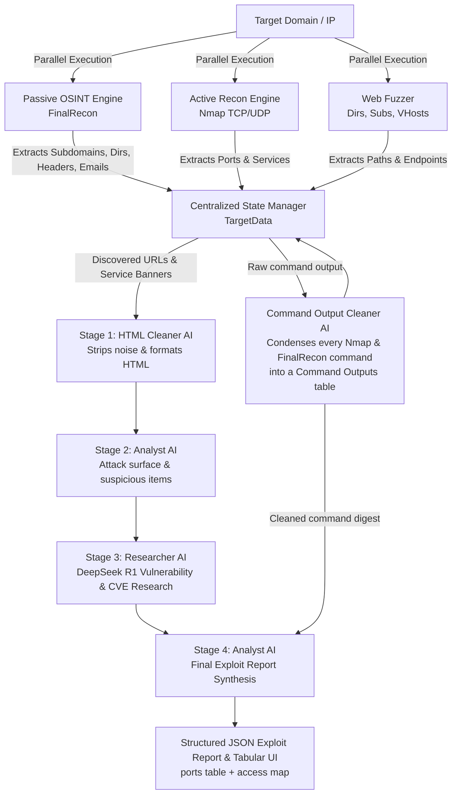

# IntelForge Scanning Framework ⚡
### Autonomous Penetration Testing & Reconnaissance AI Engine
> **Keystone Groupe, Tunisia · AI and CyberSecurity Project 2026**  
> *An end-to-end automated security framework combining passive OSINT, multi-threaded network & web discovery, and a 4-stage reasoning AI pipeline powered by Groq LLMs and DeepSeek R1.*

[](https://www.python.org/)
[](LICENSE)
[](https://groq.com)
[](https://github.com/thewhiteh4t/FinalRecon)
[]()

---

## 📌 Executive Overview

**IntelForge** is an autonomous penetration testing and intelligence framework built to eliminate manual enumeration bottlenecks during security assessments, CTFs, and Red Team operations.

It combines **passive OSINT harvesting** (FinalRecon — WHOIS, DNS, SSL/TLS, Wayback Machine, headers), **active network discovery** (Nmap TCP/UDP, web directory, subdomain & vhost fuzzing), and a **4-Stage Collaborative AI Pipeline** (powered by Groq LLMs and DeepSeek R1 reasoning). 

IntelForge automatically transitions from target discovery to structured exploit intelligence reports, drastically reducing manual enumeration time.



---

## 🚀 Key Capabilities

- 🔍 **Passive OSINT Harvesting (FinalRecon Integration)**:
  - Header inspection & security policy verification.
  - SSL/TLS certificate chain & Subject Alternative Name (SAN) extraction.
  - DNS record enumeration (A, AAAA, MX, TXT, NS, SOA, DNSKEY).
  - WHOIS registrar & registrant contact discovery.
  - Historical endpoint harvesting via Wayback Machine.
- 🎯 **Active Network Reconnaissance**:
  - Multi-threaded full TCP (`-sS -sC -sV`) and UDP top-port discovery with `nmap`.
  - Automatic service banner grabbing and version detection.
- 🌐 **Web Attack Surface Fuzzing**:
  - Directory enumeration, subdomain mapping, and HTTP host header (`VHost`) discovery.
  - Automated fallback wordlist logic and SecLists integration.
- 🧹 **Command Output Cleaner AI**:
  - Second cleaner in the pipeline, pointed at CLI output instead of HTML.
  - Condenses the raw output of every executed command (Nmap TCP/UDP sweeps, and each FinalRecon section — headers, WHOIS, DNS, SSL, subdomains, directories, wayback) into one **Command Outputs** table: `Purpose | Command | Cleaned Findings`.
  - The cleaned digest is handed to the Analyst's final synthesis alongside the research tuples.
- 🧠 **4-Stage Collaborative AI Reasoning Engine**:
  - **Stage 1 — Cleaner AI**: Strips heavy CSS/JS noise, producing clean, structured page DOMs.
  - **Stage 2 — Analyst AI (Intel)**: Maps upload points, query parameters, bypass endpoints, and identifies suspicious keywords.
  - **Stage 3 — Researcher AI (DeepSeek R1)**: Queries DeepSeek R1 reasoning engine to research CVEs, payload techniques, and pentest relevance.
  - **Stage 4 — Analyst AI (Synthesis)**: Ingests all research tuples **plus the cleaned command outputs** and generates a prioritized, actionable **Exploit Intelligence Plan** — including an open-services table and an access map (`register_required` vs `bypass_candidates`).
- 📊 **Dynamic State Management & Visualization**:
  - Real-time Metasploit-style console REPL with colored Unicode box tables.
  - Exportable structured JSON reports for hand-off to Red Teams or automated tools.

---

## 🛠️ Installation & Setup

### Prerequisites
IntelForge is designed for Linux environments (Kali Linux, Parrot OS, Ubuntu/Debian):
- **Python**: 3.10 or higher
- **Nmap**: `sudo apt install -y nmap`
- **Figlet**: `sudo apt install -y figlet` *(for dynamic colored ASCII banners)*
- **Wordlists**: `seclists`, `dirb`, or built-in fallbacks

### 1. Clone Repository & Setup
```bash
git clone https://github.com/WaelHammali/Pentest_Command_DAGDIG.git intelforge
cd intelforge
chmod +x dagdig/scripts/setup.sh
./dagdig/scripts/setup.sh
```

*(Or manual setup:)*
```bash
python3 -m venv venv
source venv/bin/activate
pip install -r dagdig/requirements.txt
```

### 2. Configure API Keys
Copy `.env.example` and set your Groq API key:
```bash
cp dagdig/.env.example dagdig/.env
```
Edit `dagdig/.env`:
```ini
GROQ_API_KEY=gsk_your_groq_api_key_here
# Optional secondary/tertiary keys for parallel LLM stages:
# GROQ_API_KEY_2=gsk_...
# GROQ_API_KEY_3=gsk_...
```

---

## 📖 Usage Guide

IntelForge can be executed via interactive console or CLI subcommands using `intelforge.py` or `dagdig.py`:

### 1. Interactive Metasploit-Style Shell
Launch the console with live prompts:
```bash
python intelforge.py
```
Inside console:
```text
intelforge > use 10.10.11.x
intelforge 10.10.11.x > scan
intelforge 10.10.11.x > show
intelforge 10.10.11.x > webanalyze
```

### 2. Full Target Scan (Nmap + Fuzzing + FinalRecon OSINT + AI Analysis)
Run parallel discovery and LLM intelligence pipeline:
```bash
python intelforge.py scan 10.10.11.x
```
*Options:*
- `--no-web`: Skip web directory/subdomain fuzzing.
- `--no-osint`: Skip FinalRecon OSINT harvesting.

### 3. Standalone FinalRecon OSINT Scan
Run deep passive OSINT on a target domain:
```bash
python intelforge.py osint example.com
```

### 4. Deep Web Attack Surface Analysis (`webanalyze`)
Execute 4-stage AI analysis directly on a web target:
```bash
python intelforge.py webanalyze http://10.10.11.x/
```

### 5. View State & Export Results
```bash
# Display formatted Unicode box tables of discovered ports, paths & vulnerabilities
python intelforge.py show

# Export current session state to JSON
python intelforge.py export results.json
```

---

## 📂 Project Architecture

```
intelforge/
├── intelforge.py                 # Root CLI launcher script
├── dagdig.py                     # Legacy / alternative entrypoint
├── README.md                     # Framework documentation
└── dagdig/                       # Main package directory
    ├── dagdig.py                 # Core CLI entrypoint & interactive REPL
    ├── core/                     # Core state engine & UI renderer
    │   ├── schema.py             # TargetData, PageAnalysis & CommandResult models
    │   ├── state.py              # State persistence manager
    │   └── banner.py             # ASCII banner & terminal formatting
    ├── exec/                     # Execution modules
    │   ├── network.py            # Nmap TCP/UDP scanner
    │   ├── web.py                # Directory, subdomain & vhost fuzzer
    │   ├── osint.py              # FinalRecon OSINT wrapper
    │   └── runner.py             # Parallel discovery coordinator
    ├── llm/                      # AI Engines & Multi-Stage Bridge
    │   ├── client.py             # Groq API client interface
    │   ├── output_cleaner.py     # CommandOutputCleaner (second cleaner: CLI output)
    │   └── llm_bridge.py         # DualGroq & TripleGroq AI Analyzers
    ├── attack/                   # Attack planning & tracking
    │   ├── tracker.py            # Real-time pipeline status tracker
    │   └── advisor.py            # WebAttackAdvisor orchestration
    ├── prompts/                  # Cleaner, analyst, research & command_clean prompt templates
    ├── data/                     # Output directory for JSON reports & raw logs
    └── scripts/
        └── setup.sh              # Automated environment setup script
```

---

## 🏢 About Keystone Groupe

Developed as part of the **AI and CyberSecurity Project 2026** at **Keystone Groupe, Tunisia**.  
IntelForge bridges traditional offensive security tools with state-of-the-art AI reasoning to automate vulnerability discovery and threat modeling.

---

## ⚖️ Disclaimer

IntelForge is intended strictly for authorized security assessments, educational purposes, CTF competitions, and penetration testing on systems with explicit written consent. Unauthorized scanning of third-party infrastructure is strictly illegal.
