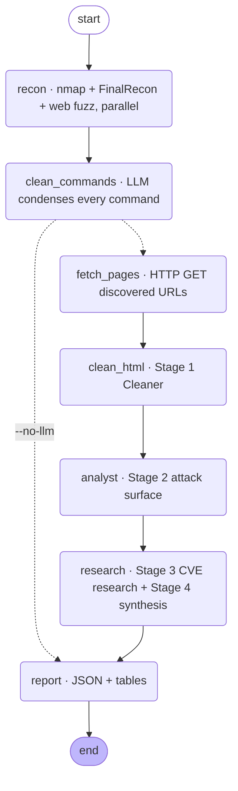

<div align="center">

# IntelForge ⚡

**LangGraph-orchestrated reconnaissance and multi-agent exploit-intelligence pipeline**

*Runs the recon collectors, condenses every tool's raw output with an LLM, then walks a fixed
chain of AI analysts — Cleaner → Analyst → Researcher → Synthesis — to turn discovery into a
structured, prioritised exploit-intelligence report.*

[](https://github.com/WaelHammali/IntelForge/actions/workflows/ci.yml)
[](https://www.python.org/)
[](https://langchain-ai.github.io/langgraph/)
[](https://docs.astral.sh/ruff/)
[](https://mypy-lang.org/)
[](LICENSE)

*Keystone Groupe, Tunisia · AI & Cybersecurity Project 2026*

</div>

---

## Why

Manual enumeration is the slow part of a security assessment, a CTF, or a Red Team engagement.
The findings are scattered across a dozen tool outputs, the version strings need cross-referencing
against CVE databases, and the "what do I attack first" call is left entirely to the operator.

IntelForge automates the loop between *discovery* and *actionable intelligence*: it collects, it
de-noises, and it reasons — producing an open-services table, an authentication/bypass access map,
a ranked list of exploit vectors, and a final verdict on the most likely foothold.

> **Authorised use only.** For security assessments, education, CTFs and penetration testing with
> explicit written consent. Unauthorised scanning of third-party infrastructure is illegal.

---

## Example run

```console
$ intelforge scan 10.10.11.20 --no-osint

[*] Reconnaissance on 10.10.11.20 — 2 collectors
[*] Full TCP scan (all ports, service + default scripts) — running: nmap -sS -sV -sC -p- --min-rate 1000 -T4 -oX - -- 10.10.11.20
[+] nmap finished
[*] Fuzzing directories
[+] directory: /admin
[+] directory: /uploads
[+] webfuzz finished
[*] Cleaning 3 command output(s)
[+] Command cleaner produced 3 row(s)
[*] Fetching 4 page(s)
[+] Cleaned 4 page(s)
[+] Analyst mapped 4 page(s)
[+] Intelligence synthesis complete
[+] Report written to data/report_10.10.11.20_20260910_193214.json

                              Open Ports
┏━━━━━━━┳━━━━━━━┳━━━━━━━━━┳━━━━━━━━━━━━━━━━━━━━━━━━━━━━━━━━━━━━━┓
┃ Port  ┃ Proto ┃ Service ┃ Version                             ┃
┡━━━━━━━╇━━━━━━━╇━━━━━━━━━╇━━━━━━━━━━━━━━━━━━━━━━━━━━━━━━━━━━━━━┩
│ 22    │ tcp   │ ssh     │ OpenSSH 8.2p1 Ubuntu 4ubuntu0.5     │
│ 80    │ tcp   │ http    │ Apache httpd 2.4.41                 │
└───────┴───────┴─────────┴────────────────────────────────────┘

Priority exploit vectors
  1. [High]     /uploads — avatar upload, no extension check → PHP webshell (.phtml)
  2. [Medium]   Apache 2.4.41 — CVE-2021-41773 path traversal (verify mod_cgi)
  3. [Medium]   /admin — reachable without authentication

Verdict: unauthenticated file upload on /uploads is the most likely initial foothold.
```

The stored JSON report (`data/report_<host>_<timestamp>.json`) carries the full typed state:
open ports/services, subdomains, directories, per-page attack surface, the researcher's CVE
tuples, and the synthesised `access_map` / `priority_exploit_vectors` / `final_verdict`.

---

## Architecture

The whole flow is a compiled **LangGraph `StateGraph`**. Every step is an explicit node, a single
shared `TargetState` is the bus between them, and each LLM node carries a `RetryPolicy`
(3 attempts, exponential backoff). The diagram below is what `intelforge graph` emits from the
running graph.



### The AI chain

Each role is a LangChain `provider:model` string, and each prompt is tuned to the *nature* of the
model behind it:

| Stage | Role | Default model | Prompt style |
| --- | --- | --- | --- |
| 1 · Cleaner | `cleaner` | `groq:llama-3.1-8b-instant` | rigid fill-in skeleton, hard length caps — a small model obeys structure, not prose |
| 2 · Analyst (attack surface) | `analyst` | `groq:llama-3.3-70b-versatile` | rich JSON schema + evidence-discipline rules (no guessed versions) |
| 3 · Researcher (CVEs / exploits) | `researcher` | `groq:deepseek-r1-distill-llama-70b` | reasoning-model framing: think freely, then one JSON object; strict anti-hallucination on CVE IDs; runs at temperature `0.6` |
| 4 · Analyst (synthesis) | `analyst` | `groq:llama-3.3-70b-versatile` | *synthesiser, not researcher* — every claim must trace to an input |

Swap any role for OpenAI, Google, or an OpenAI-compatible gateway without touching code — see
[Configuration](#configuration).

---

## Capabilities

- **Active recon (Nmap)** — configurable TCP/UDP profiles, service/version detection, XML parsed
  with `defusedxml` into typed `Port` / `Service` records.
- **Passive OSINT (FinalRecon)** — headers, SSL/TLS, DNS, WHOIS, subdomains, directories, Wayback
  endpoints, emails.
- **Web fuzzing** — directories (threaded HTTP), subdomains (`dig`), vhosts (Host header);
  skipped automatically for a bare IP.
- **Command Output Cleaner** — an LLM pass over raw CLI output: each Nmap sweep becomes one row,
  FinalRecon is fanned into per-section rows, feeding the `Purpose | Command | Cleaned Findings`
  table and a digest for the Analyst.
- **Validated targets** — every target string is checked before it can reach a subprocess:
  argument-injection attempts (`-oX`, `--script=…`), shell metacharacters and unsupported URL
  schemes are rejected up front.
- **Provider-agnostic LLMs** — `groq:…`, `openai:…`, `google_genai:…`, or any OpenAI-compatible
  base URL, via LangChain's `init_chat_model`.

---

## Install

Linux (Kali / Parrot / Debian / Ubuntu). Requires **Python 3.11–3.13**, plus `nmap`
(`sudo apt install -y nmap`) and, optionally, `figlet` and a FinalRecon checkout.

```bash
git clone https://github.com/WaelHammali/IntelForge.git
cd IntelForge
python3 -m venv .venv && source .venv/bin/activate
pip install -e ".[dev]"          # drop [dev] for a runtime-only install
cp .env.example .env             # then set GROQ_API_KEY (or another provider)
```

---

## Usage

```bash
intelforge                                    # interactive console
intelforge scan 10.10.11.20                   # full pipeline
intelforge scan 10.10.11.20 --no-web --no-osint --no-llm
intelforge osint example.com                  # passive OSINT only (FinalRecon + cleaner)
intelforge webanalyze http://10.10.11.20/     # AI web analysis, no recon
intelforge show                               # render the stored state
intelforge export report.json                 # dump the state to JSON
intelforge graph                              # print the pipeline diagram
```

The interactive console mirrors the subcommands: `use`, `scan`, `osint`, `webanalyze`, `show`,
`set`, `export`, `graph`, `clear`, `banner`, `help`, `exit`. Both front-ends run the same
handler layer, so behaviour is identical either way.

Invalid input fails cleanly — a bad target or unknown field prints one error line and exits
non-zero; it never dumps a traceback.

---

## Configuration

All settings come from environment variables (prefix `INTELFORGE_`) or a local `.env` file.

| Setting | Purpose | Default |
| --- | --- | --- |
| `INTELFORGE_LLM_CLEANER` / `_ANALYST` / `_RESEARCHER` | model per role (`provider:model`) | `groq:…` |
| `INTELFORGE_LLM_TEMPERATURE` / `_LLM_TEMPERATURE_RESEARCHER` | sampling temperature (the reasoning role needs ≈0.6) | `0.1` / `0.6` |
| `INTELFORGE_LLM_BASE_URL` | OpenAI-compatible gateway (OpenRouter, vLLM, …) | – |
| `GROQ_API_KEY` / `OPENAI_API_KEY` / `GOOGLE_API_KEY` / … | provider credentials | – |
| `INTELFORGE_FINALRECON_PATH` | path to `finalrecon.py` | see `.env.example` |
| `INTELFORGE_REQUEST_TIMEOUT` / `_FUZZ_THREADS` / `_SCAN_TIMEOUT` | tuning | `10` / `20` / `600` |
| `INTELFORGE_DATA_DIR` / `_WORDLIST_DIR` | output & wordlist roots | `data` / `wordlists` |

Legacy `GROQ_MODEL` / `_2` / `_3` are still honoured when the matching `INTELFORGE_LLM_*` is unset.

---

## Project layout

```
pyproject.toml                 # packaging, deps, ruff / mypy / pytest config
src/intelforge/
├── cli.py                     # Click subcommands + interactive console (one handler layer)
├── config.py                  # pydantic-settings Settings, per-role model + temperature
├── console/                   # Rich theme, banner, result tables
├── domain/                    # models.py (Pydantic) · state.py (TargetState) · target.py (validation)
├── tools/                     # nmap · finalrecon · webfuzz · http (shared session) · run_command
├── agents/                    # llm · html_cleaner · command_cleaner · analyst · researcher
├── graph/                     # state · nodes · pipeline (the LangGraph StateGraph)
├── reporting/                 # JSON report writer
└── prompts/                   # per-model system-prompt templates
tests/                         # 64 tests — models, state, target, config, tools, agents, graph, cli
```

---

## Development

```bash
make check          # ruff + mypy + pytest + format check  (what CI runs)
make lint           # ruff check
make type           # mypy
make test           # pytest
make fmt            # ruff format
```

CI runs the full gate on Python 3.11, 3.12 and 3.13 for every push and pull request.

---

## Roadmap

- Structured-output mode for the JSON agents where the provider supports it (regex fallback kept
  for the reasoning model).
- Pluggable collectors (`httpx`, `nuclei`, `ffuf`) behind the existing tool interface.
- Markdown / HTML report renderers alongside the JSON writer.

---

## License

MIT — see [LICENSE](LICENSE).
